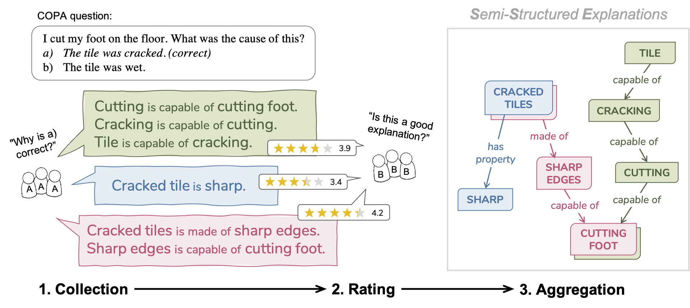

# COPA-SSE
Repository for **Semi-Structured Explanations for COPA (COPA-SSE)**.





COPA-SSE contains crowdsourced explanations for the [Balanced COPA](https://balanced-copa.github.io/) dataset, a variant of the [Choice of Plausible Alternatives (COPA)](https://people.ict.usc.edu/~gordon/copa.html) benchmark.
The explanations are formatted as a set of triple-like common sense statements with ConceptNet relations but freely written concepts.


## Data format

`dev-explained.jsonl` and `test-explained.jsonl` each contain Balanced COPA samples with added explanations in `.jsonl` format. The question ids match the original questions of the development and test set, respectively.

Each entry contains:
- the original question (matching format and ids)
- `human-explanations`: a list of explanations each containing:
    - `expl-id`: the explanation id
    - `text`: the explanation in plain text (full sentences)
    - `worker-id`: anonymized worker id (the author of the explanation)   
    - `worker-avg`: the average score the author got for their explanations
    - `all-ratings`: all collected ratings for the explanation
    - `filtered-ratings`: ratings excluding those that failed the control
    - `triples`: the triple-form explanation (a list of ConceptNet-like triples)

### Example entry:
```
id: 1, 
asks-for: cause, 
most-plausible-alternative: 1,
p: "My body cast a shadow over the grass.", 
a1: "The sun was rising.", 
a2: "The grass was cut.", 
human-explanations: [
    {expl-id: f4d9b407-681b-4340-9be1-ac044f1c2230, 
     text: "Sunrise causes casted shadows.", 
     worker-id: 3a71407b-9431-49f9-b3ca-1641f7c05f3b, 
     worker-avg: 3.5832864694635025, 
     all-ratings: [1, 3, 3, 4, 3], 
     filtered-ratings: [3, 3, 4, 3], 
     filtered-avg-rating: 3.25, 
     triples: [["sunrise", "Causes", "casted shadows"]]
     }, ...]
```

### Aggregated versions (WIP)

`graphs.pk` contains preliminary aggregated versions of the triples for each question (dictionary format with question id as the key). This file will be updated in the future.


### Example entry:
```
3: [
 ('person', 'ReceivesAction', 'catch'),
 ('meet', 'MannerOf', 'catch'),
 ('woman', 'Desires', 'catch'),
 ('coffee', 'ReceivesAction', 'drink'),
 ...
]
```

## Citation
Thank you for your interest in our dataset!
Our paper is still under review. Stay tuned! :)
```
```
